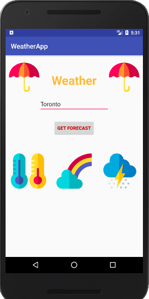
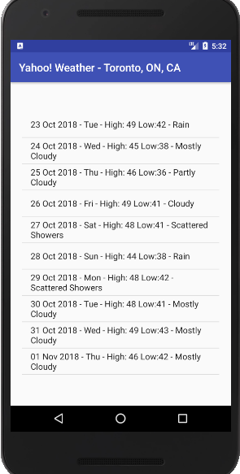

# WeatherApp
A simple Android application made in Kotlin by using the Retrofit library to get weather information from Yahoo Weather API. This application provides 10 day weather forecast of the city that the user enters.

# Screenshot

